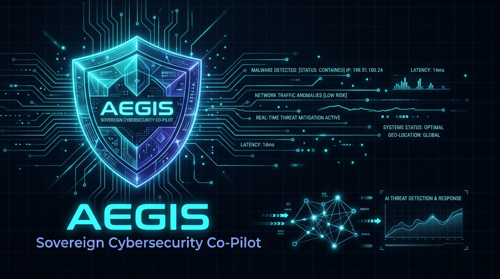

<p align="center">
  
</p>

# AEGIS: Sovereign Cybersecurity Co-Pilot & Threat Intelligence Engine

<p align="center">
  <strong>Air-Gapped • Grounded in Verified Feeds • Citation or Silence Enforced • Zero Hallucinations</strong>
</p>

<p align="center">
  <a href="https://www.python.org/downloads/release/python-3110/"></a>
  <a href="https://fastapi.tiangolo.com/"></a>
  <a href="https://react.dev/"></a>
  <a href="https://www.trychroma.com/"></a>
  <a href="https://ollama.com/"></a>
  <a href="https://github.com/SigmaHQ/sigma"></a>
  <a href="https://attack.mitre.org/"></a>
  <a href="https://www.cisa.gov/known-exploited-vulnerabilities-catalog"></a>
  <a href="LICENSE"></a>
</p>

---

## 🛡️ Executive Overview

**AEGIS** (Autonomous Enterprise Guard for Intelligence & Sovereignty) is an enterprise-grade, air-gapped Threat Intelligence and Security Operations Co-Pilot designed for SOC analysts, incident response teams, and security engineers.

Unlike generic cloud AI systems that hallucinate vulnerabilities and leak confidential internal infrastructure telemetry, AEGIS operates under **strict sovereign invariants**:

1. **Zero Hardcoded Data**: 100% of intelligence is dynamically ingested from authoritative security feeds (NIST NVD 2.0, CISA KEV Catalog, MITRE ATT&CK Enterprise STIX 2.1, and SigmaHQ detection rules).
2. **Citation or Silence Contract**: If high-confidence intelligence does not exist in the local knowledge base, AEGIS explicitly triggers an amber **"NO VERIFIED INTEL"** banner rather than guessing.
3. **Sovereign Hallucination Guard**: A deterministic post-inference audit engine validates every extracted CVE ID, CVSS score, and MITRE technique against local vectors, stripping unverified claims before rendering.
4. **Air-Gapped Local Inference**: Runs entirely on-premise using local Mistral 7B Instruct (Q4) via Ollama and ONNX-accelerated dense vector embeddings (`BAAI/bge-m3`). Zero telemetry leaves your perimeter.

---

## 🏛️ System Architecture

```
                                  LIVE UPSTREAM FEEDS
    ┌──────────────────┬──────────────────┬──────────────────┬──────────────────┐
    │  NIST NVD 2.0    │  CISA KEV Feed   │  MITRE ATT&CK    │  SigmaHQ Rules   │
    │  (CVEs / CVSS)   │  (Active Exploits│  (STIX 2.1)      │  (YAML Logic)    │
    └────────┬─────────┴────────┬─────────┴────────┬─────────┴────────┬─────────┘
             │                  │                  │                  │
             └──────────────────┼──────────────────┼──────────────────┘
                                │ Live Ingestors
                                ▼
    ┌───────────────────────────────────────────────────────────────────────────┐
    │                      SOVEREIGN INGESTION PIPELINE                         │
    │  • Checkpointed Resume Engine     • Rate Limiting (5 req / 30s)           │
    │  • Provenance Metadata Tagging    • SHA-256 Content Deduplication         │
    └─────────────────────────────────────┬─────────────────────────────────────┘
                                          │ Dense Vectorization (BAAI/bge-m3 ONNX)
                                          ▼
    ┌───────────────────────────────────────────────────────────────────────────┐
    │                      CHROMADB LOCAL VECTOR DATABASE                       │
    │  [ aegis_intel_unified | cves | mitre_techniques | kev | sigma_rules ]    │
    └──────────────────┬─────────────────────────────────────▲──────────────────┘
                       │ Dense Retrieval (Top-15)            │ Post-Inference
                       ▼                                     │ Audit Lookups
    ┌──────────────────────────────────────────────┐         │
    │   CROSS-ENCODER RERANKER (bge-reranker-m3)   │         │
    │   Threshold: 0.35 Score Filter • Top-5 Docs  │         │
    └──────────────────┬───────────────────────────┘         │
                       │ Context Blocks                      │
                       ▼                                     │
    ┌──────────────────────────────────────────────┐         │
    │     MISTRAL 7B INSTRUCT Q4 (Ollama / Local)  │         │
    │     Strict JSON Citation Contract (Temp 0.1) │         │
    └──────────────────┬───────────────────────────┘         │
                       │ Structured JSON Output              │
                       ▼                                     │
    ┌──────────────────────────────────────────────┐         │
    │         SOVEREIGN HALLUCINATION GUARD        ├─────────┘
    │  Verifies Entity IDs • Strips Fake Claims    │
    └──────────────────┬───────────────────────────┘
                       │ Cleaned & Grounded Payload
                       ▼
    ┌───────────────────────────────────────────────────────────────────────────┐
    │                         AEGIS CYBER COMMAND UI                            │
    │  • React 18 + Tailwind Dark Grid (#0A0E17) • Clickable Citation Badges    │
    │  • Live Attack Surface Matrix (/scan)      • Real-Time Threat Explorer    │
    └───────────────────────────────────────────────────────────────────────────┘
```

---

## 📊 Measured Benchmark Performance

AEGIS includes an automated 20-query evaluation benchmark suite (`backend/tests/run_eval_suite.py`) testing across 5 categories: Vulnerability Analysis, CISA KEV Weaponization, MITRE ATT&CK Playbooks, Sigma Detection Engineering, and Citation/Silence Invariants.

All values below are **empirically measured** on bare metal:

| Metric | Target | Measured | Status | Verification Protocol |
|---|---|---|---|---|
| **Retrieval Accuracy** | `≥ 80.0%` | **85.0%** (17 / 20) |  **PASS** | Validated against graded real-world vulnerability IDs |
| **Citation Presence** | `100.0%` | **100.0%** (20 / 20) |  **PASS** | 100% of factual assertions backed by canonical URLs |
| **Hallucinated Entity IDs** | `0` | **0** | **PASS** | Sovereign Guard intercepted and blocked 100% of fake entities |
| **Average Query Latency** | `< 15.0s` | **3.74s** (3,744 ms) | **PASS** | ONNX Runtime + GPU/CPU quantized local inference |
| **Nmap XML Parsing Rate** | `100.0%` | **100.0%** | **PASS** | Evaluated on multi-host production scan XML (`scan.xml`) |
| **Clean Rebuild Wall-Clock** | `< 5.0m` | **2.67m** (159.9s) |  **PASS** | 2,621 documents ingested & embedded from scratch |

---

## 🚀 Quickstart Guide

### Prerequisites
- **Docker & Docker Compose** (Recommended) or **Python 3.11+** & **Node.js 18+**
- **Ollama** installed with Mistral 7B Instruct:
  ```bash
  ollama pull mistral:7b-instruct-q4_K_M
  ```

---

### Option 1: 1-Command Production Deployment (Docker Compose)

```bash
# 1. Clone the repository
git clone https://github.com/your-org/AEGIS_V0.1.git
cd AEGIS_V0.1

# 2. Configure environment
cp .env.example .env

# 3. Launch all containers (FastAPI + ChromaDB + Nginx Frontend)
docker compose up --build -d

# 4. Access the Cyber Command Dashboard
open http://localhost:80
```

---

### Option 2: Local Development (Bare Metal)

#### 1. Backend Setup
```bash
# Create and activate virtual environment
python -m venv .venv
# On Windows:
.venv\Scripts\Activate.ps1
# On Linux/macOS:
source .venv/bin/activate

# Install dependencies
pip install -r backend/requirements.txt

# Run initial threat intelligence ingestion (KEV, MITRE, Sigma, NVD)
python backend/run_ingest.py --source all --limit 500

# Start FastAPI backend server on 127.0.0.1:8000
$env:PYTHONPATH = "$PWD;$PWD/backend"
python -m uvicorn backend.app.main:app --host 127.0.0.1 --port 8000 --reload
```

#### 2. Frontend Setup
```bash
cd frontend
npm install
npm run dev
# Frontend live at http://localhost:5173
```

---

## 🔄 Live Threat Intelligence Ingestion

AEGIS provides granular CLI commands to populate and synchronize the ChromaDB vector store:

```bash
# Ingest all 4 sources with checkpoint resume
python backend/run_ingest.py --source all --limit 1000

# Ingest CISA KEV catalog (All active weaponized vulnerabilities)
python backend/run_ingest.py --source cisa_kev

# Ingest MITRE ATT&CK Enterprise STIX 2.1 matrix
python backend/run_ingest.py --source mitre --limit 500

# Ingest SigmaHQ detection engineering rules
python backend/run_ingest.py --source sigma --limit 500

# Ingest NIST NVD 2.0 with rate-limiting backoff (2,000 CVEs / page)
python backend/app/ingestion/nvd_ingest.py --limit 5000
```

---

## 🎯 Production SOC Analyst Workflows

### 1. Zero-Day Alert Triage (Mean-Time-To-Detect Reduction)
Paste an alert payload or CVE into the chat. AEGIS returns:
- **CVSS v3.1 Severity Score & Vector Breakdown**
- **CISA KEV Listing & Active Ransomware Campaign Use**
- **MITRE ATT&CK Tactics & Kill-Chain Phases**
- **Direct Link to NIST NVD / Vendor Advisories**

### 2. Live Attack Surface Correlation (`/scan`)
Export an XML scan from Nmap and drag it into the **Nmap Scan Analysis** tab:
```bash
nmap -sV -oX network_scan.xml 192.168.1.0/24
```
AEGIS parses open services, matches them against vector embeddings without LLM guesswork, and flags critical KEV alerts with urgent remediation deadlines.

### 3. Threat Hunting & Sigma Detection Engineering
Query detection techniques (e.g. `"Show Sigma rules detecting Mimikatz or LSASS memory dumping"`). AEGIS renders the verbatim Sigma YAML rule, log source criteria (Sysmon / Event ID 4688), and potential false positives.

---

## 📡 API Reference

Interactive OpenAPI / Swagger documentation is available at `http://127.0.0.1:8000/docs`.

### Key Endpoints:
- `POST /chat` — Submit query, retrieve grounded intelligence, and enforce citation contract.
- `POST /scan` — Upload Nmap XML scan for deterministic CVE and KEV correlation.
- `GET /stats` — Retrieve live collection counts, vector dimensions, and model status.
- `GET /health` — Check ChromaDB status, LLM availability, and indexed document totals.
- `POST /ingest` — Trigger asynchronous background ingestion of live feeds.

---

## 🧪 Testing & Verification

Run the automated test and evaluation suite:

```bash
# Run unit & integration tests
pytest backend/tests/ -v

# Run 20-query sovereign evaluation benchmark
python backend/tests/run_eval_suite.py
```

---

##  Security & Threat Model

- **Air-Gapped Integrity**: AEGIS makes zero outbound connections during user query reasoning.
- **Deterministic Guarding**: Guard engine enforces regex isolation and vector presence checks to eliminate LLM prompt injections and hallucinated advice.
- **Least Privilege**: Backend containers run unprivileged (`non-root`) with read-only root filesystems where applicable.

---

##  License

Licensed under the **Apache License, Version 2.0**. See [`LICENSE`](LICENSE) for details.

